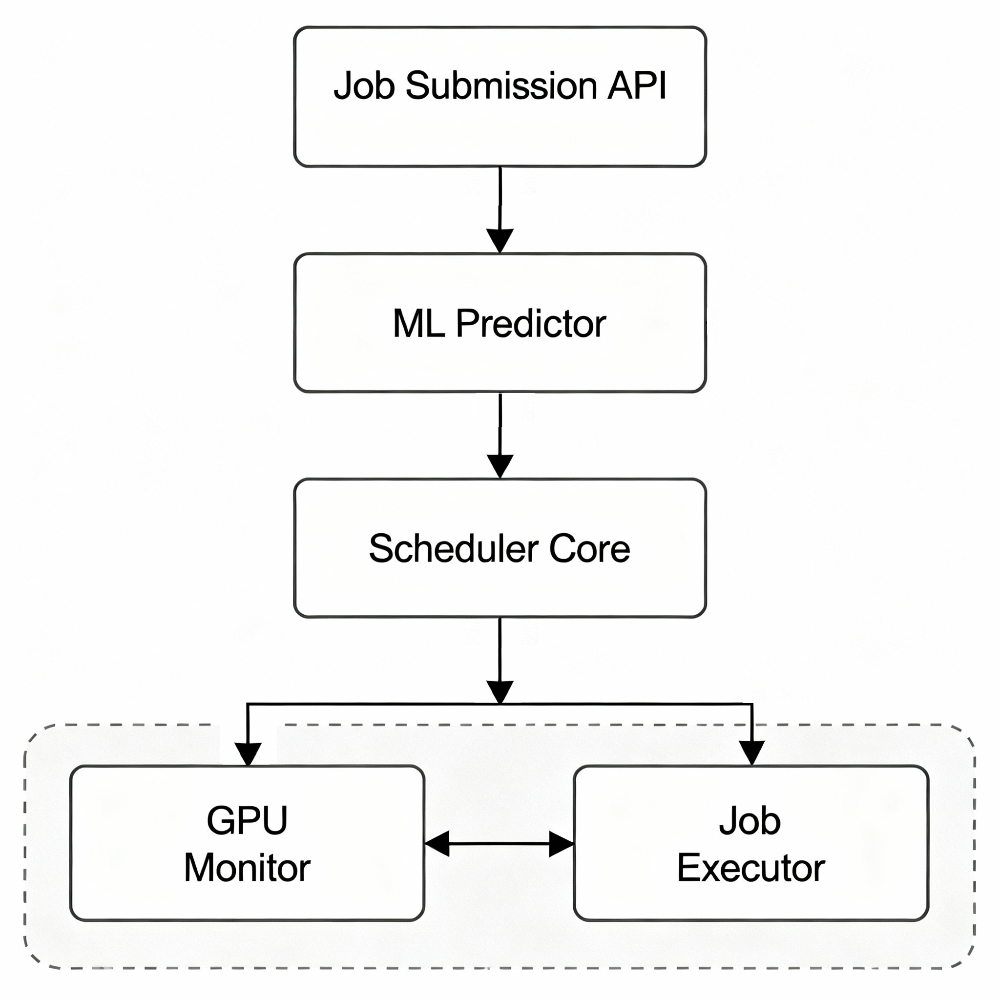

Born with the following architectural idea

Basically the system consists of four main components that work together to enable intelligent GPU job scheduling:

### 1. Job submission API
RESTful API interface for submitting ML jobs to the scheduler.

> Should be built with FastAPI for high performance and easy integration with existing ML workflows ?

### 2. ML predictor
Resource estimation engine that analyzes incoming jobs and predicts:
<ul>
<li><input type="checkbox" disabled> GPU memory usage</li>
<li><input type="checkbox" disabled> Runtime duration</li>
<li><input type="checkbox" disabled> Interference level between jobs</li>
</ul>

### 3. Scheduler core
Implement the sophisticated orchestration logic:
<ul>
<li><input type="checkbox" disabled> Bin packing algorithm: Optimally assigns multiple jobs to available GPUs</li>
<li><input type="checkbox" disabled> Interference-aware placement: Prevents resource contention by considering job compatibility</li>
<li><input type="checkbox" disabled> MPS/MIG configuration: Leverages NVIDIA Multi-Process Service and Multi-Instance GPU technologies for isolation</li>
</ul>

### 4. Job executor
Manages the actual execution environment:
<ul>
<li><input type="checkbox" disabled> Container orchestration and lifecycle management</li>
<li><input type="checkbox" disabled> Isolated execution environments per job</li>
<li><input type="checkbox" disabled> Resource allocation and enforcement</li>
</ul>

### 5. GPU monitor
Real-time monitoring component that tracks:
<ul>
<li><input type="checkbox" disabled> NVML (NVIDIA Management Library) metrics</li>
<li><input type="checkbox" disabled> Live GPU utilization and memory usage</li>
<li><input type="checkbox" disabled> Performance statistics for optimization feedback</li>
</ul>

The GPU Monitor communicates bidirectionally with the Job Executor to provide runtime insights and enable dynamic adjustments.